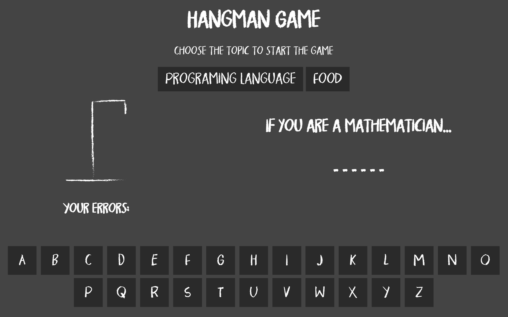

# Hangman Game

Hangman is a simple game that revolves around guessing a randomly chosen word.

## Table of contents
* [General info](#general-info)
* [Demo & Screenshot](#demo)
* [Technologies](#technologies)

## General info

- The player to start the game have to choose between two topics
- The player gets to choose an alphabet every round.
- If the alphabet does not exist in the chosen word, the player will receive one strike.
- After receiving a certain number of strikes, the player loses the game.
- The player will win the game if he/she/it correctly guesses all the alphabets.

## Demo & Screenshot

If you want to try the game click the [link](https://newhangman.netlify.app/)

## Technologies

- HTML
- CSS
- JavaScript
- ES6 Classes
